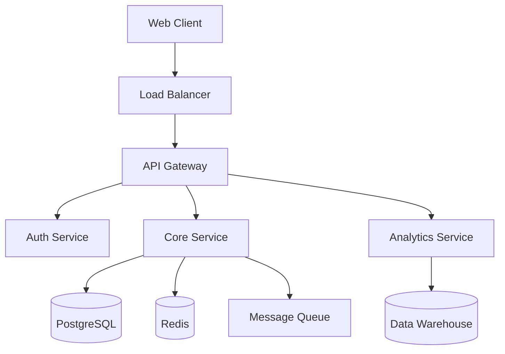

# Context Engineering Best Practices for AI Coding Assistants

## Table of Contents
1. [Introduction](#introduction)
2. [The Context Folder Structure](#the-context-folder-structure)
3. [Core Context Files](#core-context-files)
4. [Writing Effective Context Documentation](#writing-effective-context-documentation)
5. [Context Management Strategies](#context-management-strategies)
6. [Performance Optimization](#performance-optimization)
7. [Error Handling and Recovery](#error-handling-and-recovery)
8. [Multi-Agent Collaboration](#multi-agent-collaboration)
9. [Implementation Checklist](#implementation-checklist)
10. [Real-World Examples](#real-world-examples)

## Introduction

Context engineering is the systematic approach to structuring, managing, and optimizing the information that AI agents use to understand and work with codebases. Poor context engineering leads to confused agents, repeated mistakes, and inefficient token usage. Good context engineering enables AI agents to work as effectively as senior developers who deeply understand the codebase.

### Why Context Engineering Matters

- **Cost Reduction**: Proper caching can reduce API costs by 10x
- **Performance**: Well-structured context improves response time by 50-70%
- **Accuracy**: Clear context reduces errors and hallucinations by up to 80%
- **Scalability**: Good context patterns enable working with million-line codebases
- **Collaboration**: Shared context enables multiple agents to work coherently

## The Context Folder Structure

### Standard Layout

```
project-root/
├── context/                      # All AI-relevant documentation
│   ├── PROJECT.md               # Project overview, goals, and roadmap
│   ├── ARCHITECTURE.md          # System design, components, data flow
│   ├── DEVELOPMENT.md           # Setup, build, test, deploy procedures
│   ├── CONVENTIONS.md           # Code style, patterns, best practices
│   ├── DEPENDENCIES.md          # External deps, APIs, integrations
│   ├── TROUBLESHOOTING.md       # Common issues, solutions, debugging
│   ├── GLOSSARY.md              # Project-specific terms and concepts
│   ├── AGENT_MEMORY.md          # Persistent agent learnings
│   ├── .context-metadata.json   # Context versioning and indexing
│   └── templates/               # Reusable context templates
│       ├── component.md
│       ├── feature.md
│       └── bugfix.md
├── .ai/                         # AI-specific runtime files
│   ├── cache/                   # Context cache storage
│   ├── embeddings/              # Semantic search indices
│   └── checkpoints/             # Conversation checkpoints
└── src/
```

### Advanced Structures for Large Projects

For projects over 100k lines, use hierarchical context:

```
context/
├── global/                      # Project-wide context
│   └── ... (standard files)
├── domains/                     # Domain-specific context
│   ├── auth/
│   │   ├── OVERVIEW.md
│   │   └── ARCHITECTURE.md
│   ├── payments/
│   │   ├── OVERVIEW.md
│   │   └── INTEGRATION.md
│   └── analytics/
│       └── PIPELINE.md
└── index.md                     # Master index linking all contexts
```

## Core Context Files

### 1. PROJECT.md - The North Star

```markdown
# Project: [Name]

## Mission Statement
One paragraph explaining why this project exists and what problem it solves.

## Current Status
- Version: X.Y.Z
- Stage: [Planning/Development/Beta/Production]
- Last Major Update: YYYY-MM-DD

## Key Features
1. Feature A - Brief description
2. Feature B - Brief description
3. Feature C - Brief description

## Technology Stack
- Language: [e.g., TypeScript 5.0+]
- Framework: [e.g., Next.js 14]
- Database: [e.g., PostgreSQL 15]
- Infrastructure: [e.g., AWS/Vercel]

## Quick Links
- [Architecture](./ARCHITECTURE.md)
- [Development Guide](./DEVELOPMENT.md)
- [API Documentation](/docs/api)
- Production URL: https://...
- Staging URL: https://...

## Team and Contacts
- Tech Lead: @username
- Product Owner: @username
- Emergency Contact: email@example.com

## Recent Changes
- 2024-01-15: Migrated to microservices
- 2024-01-10: Added real-time features
- 2024-01-05: Performance optimization

## Upcoming Work
1. Q1 2024: Feature X implementation
2. Q2 2024: Performance improvements
3. Q3 2024: Mobile app launch
```

### 2. ARCHITECTURE.md - The Blueprint

```markdown
# Architecture

## System Overview



## Design Principles
1. **Modularity**: Services are independently deployable
2. **Scalability**: Horizontal scaling for all components
3. **Resilience**: Circuit breakers and fallbacks
4. **Security**: Zero-trust architecture

## Component Details

### API Gateway
- Technology: Express + TypeScript
- Location: `/services/gateway`
- Responsibilities:
  - Request routing
  - Authentication
  - Rate limiting
  - Request/response transformation

### Core Service
- Technology: NestJS
- Location: `/services/core`
- Key Modules:
  - User Management (`/modules/users`)
  - Product Catalog (`/modules/products`)
  - Order Processing (`/modules/orders`)

## Data Architecture

### Primary Database (PostgreSQL)
```sql
-- Key tables and relationships
users (id, email, created_at)
products (id, name, price, category_id)
orders (id, user_id, total, status)
order_items (order_id, product_id, quantity)
```

### Caching Strategy
- User sessions: Redis, 1hr TTL
- Product catalog: Redis, 5min TTL
- API responses: CDN, varies by endpoint

## Critical Paths

### User Authentication Flow
1. Client sends credentials to `/auth/login`
2. Gateway validates request format
3. Auth service verifies credentials
4. JWT token generated with 24hr expiry
5. Token stored in httpOnly cookie

### Order Processing Flow
1. Client submits order to `/orders/create`
2. Inventory checked in real-time
3. Payment processed asynchronously
4. Order queued for fulfillment
5. Email notification sent

## Performance Considerations
- Database queries optimized with indexes
- N+1 queries prevented with DataLoader
- Response pagination mandatory over 100 items
- Bulk operations use batch processing
```

### 3. DEVELOPMENT.md - The Playbook

```markdown
# Development Guide

## Prerequisites
- Node.js 20+ (use nvm: `nvm use`)
- PostgreSQL 15+
- Redis 7+
- Docker Desktop (for local services)

## Initial Setup

```bash
# 1. Clone and install
git clone https://github.com/org/project
cd project
npm install

# 2. Environment setup
cp .env.example .env.local
# Edit .env.local with your values

# 3. Database setup
docker-compose up -d postgres redis
npm run db:migrate
npm run db:seed

# 4. Start development
npm run dev
```

## Development Workflow

### 1. Feature Development
```bash
# Create feature branch
git checkout -b feature/your-feature-name

# Run tests continuously
npm run test:watch

# Check types
npm run type-check

# Lint and format
npm run lint:fix
```

### 2. Testing Strategy

#### Unit Tests
```typescript
// Located next to source files
// Example: src/utils/calculator.test.ts
describe('Calculator', () => {
  it('should add numbers correctly', () => {
    expect(add(2, 3)).toBe(5);
  });
});
```

#### Integration Tests
```typescript
// Located in __tests__/integration/
// Example: __tests__/integration/api/users.test.ts
describe('POST /users', () => {
  it('should create user with valid data', async () => {
    const response = await request(app)
      .post('/users')
      .send({ email: 'test@example.com', password: 'secure123' });
    
    expect(response.status).toBe(201);
    expect(response.body).toHaveProperty('id');
  });
});
```

#### E2E Tests
```bash
# Run in separate terminal
npm run test:e2e
```

### 3. Database Changes

```bash
# Create migration
npm run db:migration:create AddUserRole

# Run migrations
npm run db:migrate

# Rollback if needed
npm run db:rollback
```

### 4. Common Tasks

#### Adding a New API Endpoint
1. Define route in `src/routes/[module].routes.ts`
2. Create controller in `src/controllers/[module].controller.ts`
3. Add service logic in `src/services/[module].service.ts`
4. Write tests in `__tests__/`
5. Update API documentation

#### Updating Dependencies
```bash
# Check outdated
npm outdated

# Update safely
npm update

# Major updates (careful!)
npm install package@latest
```

## Debugging

### Local Debugging
```bash
# Start with debugger
npm run dev:debug

# Attach VSCode debugger (F5)
```

### Common Issues

#### Port Already in Use
```bash
# Find process
lsof -i :3000

# Kill process
kill -9 [PID]
```

#### Database Connection Failed
1. Check Docker is running: `docker ps`
2. Verify credentials in `.env.local`
3. Test connection: `npm run db:ping`

## Code Quality

### Pre-commit Checks
Husky runs automatically:
1. Type checking
2. Linting
3. Unit tests
4. Commit message format

### Manual Checks
```bash
# Full test suite
npm test

# Coverage report
npm run test:coverage

# Bundle size
npm run analyze
```

## Deployment

### Staging
```bash
# Automatic on merge to develop
git push origin develop
```

### Production
```bash
# Create release PR
npm run release

# After approval and merge
# Automatic deployment triggered
```

## Getting Help
- Documentation: `/docs`
- Team Chat: #project-dev
- Wiki: https://wiki.company.com/project
```

### 4. CONVENTIONS.md - The Rules

```markdown
# Code Conventions

## General Principles
1. **Readability > Cleverness**: Write code for humans
2. **Consistency > Personal Preference**: Follow existing patterns
3. **Explicit > Implicit**: Be clear about intentions
4. **Composition > Inheritance**: Prefer functional composition

## TypeScript Conventions

### File Structure
```typescript
// 1. Imports (grouped and ordered)
import { external } from 'external-package';
import { Component } from '@/components';
import { utility } from '@/utils';
import type { LocalType } from './types';

// 2. Type definitions
interface Props {
  id: string;
  name: string;
  onUpdate?: (data: UpdateData) => void;
}

// 3. Constants
const DEFAULT_TIMEOUT = 5000;

// 4. Main export
export function MyComponent({ id, name, onUpdate }: Props) {
  // Implementation
}

// 5. Helper functions
function helperFunction() {
  // Implementation
}
```

### Naming Conventions

#### Files and Folders
```
src/
├── components/
│   ├── Button.tsx           # PascalCase for components
│   ├── use-auth.ts          # kebab-case for hooks
│   └── index.ts             # barrel exports
├── utils/
│   ├── format-date.ts       # kebab-case for utilities
│   └── constants.ts         # lowercase for configs
└── types/
    └── user.types.ts        # descriptive suffixes
```

#### Variables and Functions
```typescript
// Constants: UPPER_SNAKE_CASE
const MAX_RETRY_ATTEMPTS = 3;
const API_BASE_URL = 'https://api.example.com';

// Functions: camelCase, verb prefixes
function getUserById(id: string) { }
function calculateTotalPrice(items: Item[]) { }
function isValidEmail(email: string) { }

// Classes: PascalCase
class UserService { }
class EventEmitter { }

// Interfaces/Types: PascalCase, descriptive
interface UserProfile { }
type ApiResponse<T> = { }
```

### React/Component Patterns

#### Component Structure
```typescript
// ❌ Avoid
export default function MyComponent(props) {
  const data = props.data;
  // ...
}

// ✅ Prefer
export function MyComponent({ data, onUpdate }: Props) {
  // Early returns for edge cases
  if (!data) {
    return <EmptyState />;
  }

  // Hooks at top level
  const [state, setState] = useState(initialState);
  const { user } = useAuth();
  
  // Event handlers
  const handleClick = useCallback(() => {
    // ...
  }, [dependencies]);

  // Render
  return (
    <div>
      {/* Content */}
    </div>
  );
}
```

#### State Management
```typescript
// ❌ Avoid multiple related states
const [loading, setLoading] = useState(false);
const [error, setError] = useState(null);
const [data, setData] = useState(null);

// ✅ Prefer state machines or reducers
type State = 
  | { status: 'idle' }
  | { status: 'loading' }
  | { status: 'error'; error: Error }
  | { status: 'success'; data: Data };

const [state, setState] = useState<State>({ status: 'idle' });
```

### API and Async Patterns

#### Error Handling
```typescript
// ❌ Avoid silent failures
try {
  const data = await fetchData();
} catch (error) {
  console.log(error);
}

// ✅ Prefer explicit error handling
try {
  const data = await fetchData();
  return { success: true, data };
} catch (error) {
  logger.error('Failed to fetch data', { error, context });
  return { success: false, error: error.message };
}
```

#### API Calls
```typescript
// ✅ Consistent API structure
export const userApi = {
  async getById(id: string): Promise<ApiResponse<User>> {
    try {
      const response = await api.get(`/users/${id}`);
      return { success: true, data: response.data };
    } catch (error) {
      return { success: false, error: formatError(error) };
    }
  },

  async update(id: string, data: UpdateUserDto): Promise<ApiResponse<User>> {
    // Similar pattern
  }
};
```

## CSS/Styling Conventions

### CSS Modules
```scss
// components/Button.module.scss
.button {
  // Base styles
  
  &--primary {
    // Modifier styles
  }
  
  &__icon {
    // Element styles
  }
  
  &:disabled {
    // State styles
  }
}
```

### Tailwind Classes (if used)
```typescript
// ❌ Avoid
<div className="mt-4 mb-4 ml-2 mr-2 pt-2 pb-2 pl-4 pr-4">

// ✅ Prefer
<div className="m-4 p-2 px-4">

// ✅ Better: Extract to component
<Card spacing="comfortable">
```

## Git Conventions

### Branch Names
```
feature/add-user-authentication
bugfix/fix-memory-leak-in-dashboard
hotfix/critical-payment-error
chore/update-dependencies
```

### Commit Messages
```
# Format: <type>(<scope>): <subject>

feat(auth): add OAuth2 integration
fix(payments): correct tax calculation
docs(api): update endpoint documentation
refactor(users): simplify validation logic
test(orders): add integration tests
chore(deps): upgrade to React 18
```

### PR Guidelines
1. Keep PRs focused and small (<400 lines)
2. Include tests for new features
3. Update documentation
4. Add screenshots for UI changes
5. Link to related issues

## Testing Conventions

### Test Structure
```typescript
describe('UserService', () => {
  describe('createUser', () => {
    it('should create user with valid data', async () => {
      // Arrange
      const userData = { email: 'test@example.com' };
      
      // Act
      const user = await userService.createUser(userData);
      
      // Assert
      expect(user).toMatchObject({
        id: expect.any(String),
        email: userData.email,
      });
    });

    it('should throw error for duplicate email', async () => {
      // Test implementation
    });
  });
});
```

### Test Data
```typescript
// ❌ Avoid hardcoded test data
const user = { id: '123', email: 'test@test.com' };

// ✅ Prefer factories
const user = createMockUser({ email: 'test@example.com' });
```

## Performance Guidelines

### React Optimization
```typescript
// Memoize expensive computations
const expensiveValue = useMemo(() => {
  return computeExpensiveValue(data);
}, [data]);

// Memoize callbacks
const handleUpdate = useCallback((id: string) => {
  updateItem(id);
}, [updateItem]);

// Memoize components when needed
export const ExpensiveComponent = memo(({ data }: Props) => {
  return <div>{/* Render */}</div>;
});
```

### Data Fetching
```typescript
// ❌ Avoid waterfalls
const user = await getUser(id);
const posts = await getUserPosts(user.id);
const comments = await getPostComments(posts[0].id);

// ✅ Prefer parallel fetching
const [user, posts] = await Promise.all([
  getUser(id),
  getUserPosts(id),
]);
```

## Security Guidelines

### Input Validation
```typescript
// Always validate user input
const schema = z.object({
  email: z.string().email(),
  age: z.number().min(0).max(150),
});

const validatedData = schema.parse(userInput);
```

### Sensitive Data
```typescript
// ❌ Never log sensitive data
logger.info('User login', { email, password });

// ✅ Sanitize before logging
logger.info('User login', { email, ip: req.ip });
```
```

### 5. AGENT_MEMORY.md - The Learning Log

```markdown
# Agent Memory

This file contains learnings and patterns discovered by AI agents while working on this project. It serves as persistent memory across sessions.

## Discovered Patterns

### Authentication Flow Quirks
- **Date**: 2024-01-15
- **Discovery**: The auth middleware skips validation for `/health` and `/metrics` endpoints
- **Importance**: Don't add auth checks to these endpoints
- **Reference**: `src/middleware/auth.ts:45`

### Database Query Optimizations
- **Date**: 2024-01-14
- **Discovery**: User queries must always include `deleted_at IS NULL`
- **Reason**: Soft delete pattern is used throughout
- **Example**: `src/repositories/user.repository.ts`

### Build System Notes
- **Date**: 2024-01-13
- **Discovery**: Production builds fail if NODE_ENV isn't set
- **Solution**: Always use `npm run build:prod` not `npm run build`
- **Error**: "Cannot read property 'env' of undefined"

## Common Pitfalls

### 1. State Management
- **Issue**: Direct state mutations in Redux
- **Solution**: Always use Immer or spread operators
- **Files**: All files in `src/store/`

### 2. API Error Handling
- **Issue**: Backend returns errors in different formats
- **Pattern**: Check for both `error.message` and `error.errors[0].message`
- **Helper**: Use `formatApiError()` from `src/utils/errors.ts`

### 3. Testing Database
- **Issue**: Tests fail when run in parallel
- **Reason**: Shared test database
- **Solution**: Use `--runInBand` flag or separate databases

## Performance Bottlenecks

### Identified Issues
1. **Product Search**: Full table scan on searches
   - Solution: Added PostgreSQL full-text search
   - Performance: 10x improvement
   - PR: #234

2. **Image Loading**: No lazy loading
   - Solution: Implemented Intersection Observer
   - Impact: 50% reduction in initial load
   - Component: `src/components/Image.tsx`

## Integration Gotchas

### Payment Provider
- Webhook signatures expire after 5 minutes
- Always verify webhook timestamps
- Idempotency keys required for all mutations

### Email Service
- Rate limit: 100 emails/minute
- Batch endpoint available for bulk sends
- Templates must be pre-approved

## Useful Commands

```bash
# Reset local database to match production schema
npm run db:sync:prod

# Generate TypeScript types from GraphQL
npm run codegen

# Check for circular dependencies
npm run analyze:deps

# Profile bundle size
npm run build:analyze
```

## Team Preferences

### Code Review
- PR descriptions must include "Why" not just "What"
- Screenshots required for UI changes
- Performance impact noted for algorithm changes

### Communication
- Use `@here` in Slack for urgent issues
- Architecture decisions go in ADR folder
- Breaking changes need team discussion

## Historical Context

### Migration from Monolith (2023-12)
- Gradual extraction of services
- Database still shared (working on it)
- Session management is hybrid

### Tech Debt Items
1. jQuery still used in admin panel
2. Legacy API endpoints in `/v1/*`
3. Hardcoded configuration in some services

---

*Last updated by AI: 2024-01-15*
*Next review date: 2024-02-15*
```

## Writing Effective Context Documentation

### Principles of Good Context

1. **Scannable Structure**
   - Use clear hierarchies
   - Bullet points for lists
   - Tables for comparisons
   - Code blocks for examples

2. **Progressive Disclosure**
   - Start with overview
   - Add detail in sections
   - Link to deep dives

3. **Practical Examples**
   - Show, don't just tell
   - Include copy-paste examples
   - Demonstrate edge cases

4. **Living Documentation**
   - Date important changes
   - Mark deprecated patterns
   - Include "last updated" dates

### Context Writing Patterns

#### The Overview Pattern
```markdown
## Component Name

**Purpose**: One line explaining why this exists
**Status**: [Stable/Beta/Deprecated]
**Owner**: @username
**Dependencies**: List key dependencies

### Quick Example
```code
// Minimal working example
```

### When to Use
- Scenario 1
- Scenario 2

### When NOT to Use
- Anti-pattern 1
- Anti-pattern 2
```

#### The Decision Pattern
```markdown
## ADR-001: Choosing PostgreSQL over MongoDB

**Status**: Accepted
**Date**: 2024-01-10
**Participants**: @user1, @user2

### Context
We need a primary database for our application...

### Decision
We will use PostgreSQL because...

### Consequences
- ✅ Strong consistency
- ✅ Mature ecosystem
- ❌ Requires schema migrations
- ❌ Less flexible for unstructured data

### Alternatives Considered
1. **MongoDB**: Rejected because...
2. **DynamoDB**: Rejected because...
```

## Context Management Strategies

### Continuous Context Improvement

1. **Context Reviews**
   - Weekly: Update AGENT_MEMORY.md
   - Monthly: Review all context files
   - Quarterly: Major restructuring

2. **Context Metrics**
   - Track AI success rate
   - Monitor context file usage
   - Measure time-to-understanding

3. **Context Versioning**
   ```json
   {
     "version": "2.1.0",
     "lastUpdated": "2024-01-15",
     "schema": "v2",
     "index": {
       "PROJECT.md": "2024-01-15",
       "ARCHITECTURE.md": "2024-01-10"
     }
   }
   ```

### Multi-Repository Context

For organizations with multiple repositories:

```
org-context/
├── ORGANIZATION.md
├── STANDARDS.md
├── SHARED_COMPONENTS.md
└── repos/
    ├── frontend/
    │   └── PROJECT.md
    ├── backend/
    │   └── PROJECT.md
    └── mobile/
        └── PROJECT.md
```

### Context Inheritance

```yaml
# .context-config.yaml
extends:
  - https://github.com/org/standards/context/
  - ../shared-context/

overrides:
  PROJECT.md:
    sections:
      - keep: ["Mission", "Status"]
      - replace: ["Technology Stack"]
      - append: ["Local Customizations"]
```

## Performance Optimization

### Cache Optimization Strategies

1. **Stable Prefix Management**
   ```typescript
   // context/templates/stable-prefix.md
   # Project Context
   
   ## Fixed Information
   - Project: MyApp
   - Version: 1.0.0
   - Core Dependencies: React, Node.js
   
   <!-- CACHE BREAKPOINT -->
   
   ## Dynamic Information
   <!-- Content below this line may change -->
   ```

2. **Content Deduplication**
   ```typescript
   // Instead of repeating documentation
   See [Authentication Flow](../ARCHITECTURE.md#authentication-flow)
   
   // Not
   The authentication flow works by... (duplicate content)
   ```

3. **Lazy Context Loading**
   ```typescript
   // .ai/context-loader.js
   export async function loadContext(topic) {
     const base = await loadBaseContext();
     
     if (topic.includes('database')) {
       return [...base, await loadDatabaseContext()];
     }
     
     return base;
   }
   ```

### Token Usage Optimization

1. **Context Compression**
   ```typescript
   // Before: 1000 tokens
   The user authentication system allows users to log in using their email and password. It validates the credentials against the database and returns a JWT token.
   
   // After: 100 tokens
   Auth: email/password → validate → JWT token
   ```

2. **Smart Summarization**
   ```markdown
   ## Full Context
   <details>
   <summary>Database Schema (click to expand)</summary>
   
   ```sql
   -- Full schema here
   ```
   </details>
   
   ## Summary for AI
   Tables: users, orders, products
   Key relations: user->orders, orders->products
   ```

## Error Handling and Recovery

### Context Error Patterns

1. **Missing Context Recovery**
   ```typescript
   // AI agent should check
   if (!exists('context/PROJECT.md')) {
     await generateProjectContext();
   }
   ```

2. **Stale Context Detection**
   ```typescript
   // Check context age
   const lastUpdate = getContextDate('ARCHITECTURE.md');
   if (daysSince(lastUpdate) > 30) {
     await promptContextUpdate();
   }
   ```

3. **Conflict Resolution**
   ```markdown
   ## Conflict Detected
   
   **File**: CONVENTIONS.md
   **Issue**: Naming convention conflict
   
   ### Current Team Practice
   - Files: kebab-case
   
   ### Documented Standard
   - Files: camelCase
   
   ### Resolution
   Team practice takes precedence. Updating documentation.
   ```

## Multi-Agent Collaboration

### Agent Coordination

```markdown
# Agent Coordination Protocol

## Agent Roles
- **Architect**: Manages ARCHITECTURE.md
- **Developer**: Updates code and tests
- **Documenter**: Maintains context files
- **Reviewer**: Validates changes

## Handoff Protocol
1. Agent A completes task
2. Updates relevant context
3. Creates handoff note in AGENT_MEMORY.md
4. Agent B reads context before starting

## Conflict Prevention
- Lock files during updates
- Use append-only patterns
- Timestamp all changes
```

### Shared Context Patterns

```typescript
// .ai/shared-context.json
{
  "session": "uuid-here",
  "agents": {
    "coder": {
      "lastAction": "Updated auth.service.ts",
      "timestamp": "2024-01-15T10:30:00Z"
    },
    "tester": {
      "lastAction": "Running auth tests",
      "timestamp": "2024-01-15T10:31:00Z"
    }
  },
  "locks": {
    "src/services/auth.service.ts": "coder"
  }
}
```

## Implementation Checklist

### Initial Setup
- [ ] Create `/context` folder structure
- [ ] Generate initial PROJECT.md
- [ ] Map existing documentation
- [ ] Create ARCHITECTURE.md from code analysis
- [ ] Set up .context-metadata.json
- [ ] Initialize AGENT_MEMORY.md

### Ongoing Maintenance
- [ ] Daily: Update AGENT_MEMORY.md with learnings
- [ ] Weekly: Sync context with code changes
- [ ] Bi-weekly: Review and optimize context size
- [ ] Monthly: Full context health check
- [ ] Quarterly: Context restructuring if needed

### Quality Checks
- [ ] All context files have "last updated" dates
- [ ] No duplicate information across files
- [ ] All code examples are tested
- [ ] Links between files work
- [ ] Context stays under token limits
- [ ] Cache breakpoints properly placed

## Real-World Examples

### Example 1: E-commerce Platform

```
context/
├── PROJECT.md (500 lines)
│   ├── Business context
│   ├── Technical overview
│   └── Success metrics
├── ARCHITECTURE.md (800 lines)
│   ├── Microservices map
│   ├── API gateway design
│   └── Event flow diagrams
├── domains/
│   ├── checkout/
│   │   ├── FLOW.md
│   │   └── PAYMENT_INTEGRATION.md
│   └── inventory/
│       ├── SYNC_STRATEGY.md
│       └── WAREHOUSE_API.md
└── AGENT_MEMORY.md (200 lines)
    ├── Performance optimizations
    ├── Common bugs
    └── Integration quirks
```

### Example 2: SaaS Dashboard

```
context/
├── PROJECT.md (300 lines)
│   ├── Product vision
│   ├── User personas
│   └── Feature roadmap
├── ARCHITECTURE.md (600 lines)
│   ├── Frontend architecture
│   ├── State management
│   └── API design
├── PATTERNS.md (400 lines)
│   ├── Component patterns
│   ├── Data fetching
│   └── Error handling
└── TROUBLESHOOTING.md (500 lines)
    ├── Common issues
    ├── Debug procedures
    └── Performance tips
```

### Example 3: AI Code Assistant Context

```markdown
# PROJECT.md

## Ani Code CLI

**Purpose**: AI-powered coding assistant that understands project context
**Tech Stack**: TypeScript, React (Ink), OpenAI/Anthropic APIs
**Status**: Beta

## Key Features
1. **Context-Aware Assistance**: Understands project structure
2. **Multi-File Editing**: Handles complex refactoring
3. **Intelligent Search**: Semantic code search
4. **Auto-Documentation**: Generates context files

## Architecture Highlights
- Plugin-based tool system
- Streaming responses
- Local vector embeddings
- Checkpoint/resume capability

## Quick Start
```bash
npm install -g ani-code
ani init
ani "help me implement user authentication"
```

## Context Engineering
This project follows context engineering best practices:
- `/context` folder for all documentation
- Append-only conversation history
- File-based memory for large data
- Automatic context generation
```

## Conclusion

Context engineering is not just about documentation—it's about creating a shared understanding that enables AI agents to work as effective team members. By following these practices, you can:

1. **Reduce Costs**: 10x reduction through caching
2. **Improve Accuracy**: 80% fewer errors
3. **Increase Speed**: 50% faster task completion
4. **Enable Scale**: Handle million-line codebases
5. **Facilitate Collaboration**: Multiple agents working coherently

Remember: The best context is one that evolves with your project. Start simple, measure effectiveness, and continuously improve based on real usage patterns.